# 🐳 Docker Projects — Deep Dive

## Overview

This section documents the **multi-project Docker Compose ecosystem** deployed on your Hostinger Cloud server.  
Each project acts as a modular node in your cognitive infrastructure — designed for both independence and orchestration.

---

## 🧩 Modular Compose Projects

| Project | Purpose | Typical Containers | Integration Notes |
|----------|----------|--------------------|-------------------|
| **localai** | Core AI stack providing cognitive orchestration and LLM routing. | `flowise`, `langfuse`, `neo4j`, `supabase`, `qdrant`, `ollama`, `n8n` | Central nervous system — acts as the core orchestration layer connecting data stores, vector memory, and workflow triggers. |
| **maui** | Backend for the multi-agent “Mindset App” (mental health / cognitive automation). | `fastapi`, `redis`, `postgres` | Interfaces with localai agents for mental-model inference and journaling pipelines. |
| **mem0** | Lightweight persistent memory API. | `mem0`, `redis` | Externalized memory layer — can store embeddings or contextual traces used by localai and maui agents. |
| **o3** | Healthcare automation environment using OpenMRS. | `openmrs`, `mysql`, `rest` | Integrates with AI agents for medical knowledge graph enrichment. |
| **arcane** | Experimental single-service AI stack. | `flowise` | Used for prototype agents, agent-to-agent cognition tests, or minimal RAG experiments. |

---

## 🧠 Project Interdependencies

Your environment is not just containerized — it’s *cognitively wired*.  
Each project contributes to an overarching multi-agent system, where agents share data, embeddings, and workflow events.

### 🕸️ Cross-Project Data Flows

```mermaid
graph TD
    subgraph localai["🧠 localai"]
        A[Flowise / Langfuse] --> B[Supabase]
        A --> C[Qdrant]
        A --> D[Neo4j]
    end

    subgraph maui["💬 maui"]
        E[FastAPI] --> B
        E --> C
        E --> D
    end

    subgraph mem0["🧬 mem0"]
        F[mem0 API] --> C
        F --> D
    end

    subgraph o3["🏥 o3"]
        G[OpenMRS] --> D
    end

    subgraph arcane["🔮 arcane"]
        H[Flowise Experimental] --> B
    end

    B -. "Shared embeddings & state" .-> C
    C -. "Vector + graph sync" .-> D
```

---

## 🧠 Data and Memory Layers

| Layer | Technology | Role |
|--------|-------------|------|
| **Relational** | Supabase (PostgreSQL) | Persistent structured data for users, agents, and tasks. |
| **Vector** | Qdrant | Embedding store for contextual retrieval and semantic memory. |
| **Graph** | Neo4j | Cognitive knowledge graph for relationships, reasoning chains, and lineage tracking. |
| **Cache / Memory** | Redis | Shared short-term memory for agents and services. |

This tri-layered memory model allows agents to operate contextually — Supabase for history, Qdrant for semantics, and Neo4j for reasoning.

---

## 🔄 Event & Workflow Automation

Workflows are orchestrated through **n8n**, which acts as the event bus between agents, APIs, and system-level triggers.

Example automations:

| Trigger | Action | Result |
|----------|--------|--------|
| Supabase webhook | n8n HTTP trigger → Flowise agent | Real-time LLM processing of database events |
| Neo4j event stream | n8n → Qdrant update | Synchronizes new relationships as embeddings |
| GitHub push | n8n → FastAPI / Langfuse | Automates deployments or triggers pipeline rebuilds |

---

## ☸️ Kubernetes Interop (KIND)

While Docker Compose handles local orchestration, KIND provides a **sandbox for future Kubernetes-native AI workflows**.

- Each Compose project can be migrated to a Helm chart via `kompose convert`.  
- Experiments with [`dot-ai`](https://github.com/journeyman33/dot-ai) test AI-driven Kubernetes automation.  
- Ideal for running agent-driven autoscaling or container self-healing via LLM reasoning.

---

## 🧭 Summary

Your multi-project Docker ecosystem functions as a **living cognitive laboratory** — a blend of DevOps precision and AI curiosity.  
It bridges traditional automation (CI/CD, observability) with cognitive infrastructure (memory, reasoning, orchestration).

---

➡️ Next: [Kubernetes KIND Cluster](./04_k8s_kind_cluster.md)

