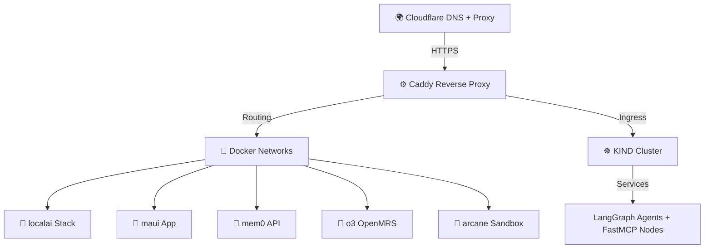
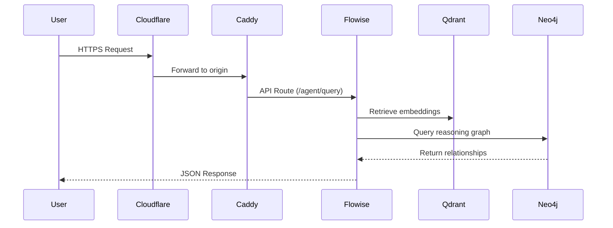

# 🌐 Network Topology — Hostinger Infrastructure Routing

## Overview

Your Hostinger server is a **multi-network cognitive automation hub**.  
Traffic flows from Cloudflare → Caddy → Docker networks → Kubernetes pods, forming a layered structure that enables secure routing and observability.

---

## 🧭 High-Level Network Map



---

## 🧩 Routing Layers

### 1. Cloudflare (Edge Layer)
Your public DNS and SSL termination layer.  
Each subdomain (e.g. `flowise.bigtorig.com`, `supabase.bigtorig.com`) routes to Caddy via HTTPS.

| Component | Role | Example |
|------------|------|----------|
| **DNS Proxy** | Hides Hostinger origin IP | `flowise.bigtorig.com` → `cloudflare` → `hostinger` |
| **SSL/TLS** | Managed at edge | Automatic cert renewal via Cloudflare |
| **Firewall / Zero Trust** | Optional protection | Restrict inbound to Cloudflare IPs |

---

### 2. Caddy (Reverse Proxy Layer)
Caddy serves as your **central routing brain**, automatically managing certificates and directing inbound requests.

Example from your `Caddyfile`:

```caddyfile
flowise.bigtorig.com {
    reverse_proxy localhost:3000
}

supabase.bigtorig.com {
    reverse_proxy localhost:54323
}

n8n.bigtorig.com {
    reverse_proxy localhost:5678
}
```

Caddy also supports **dynamic config reloads** and **JSON API reconfiguration**, enabling AI-based proxy management experiments.

---

### 3. Docker Network Layout

Each Compose project defines an isolated virtual network for container grouping.

| Project | Network | Exposed Ports |
|----------|----------|----------------|
| `localai` | `localai_net` | 3000 (Flowise), 8080 (Ollama), 54323 (Supabase), 6333 (Qdrant) |
| `maui` | `maui_net` | 8000 (FastAPI), 6379 (Redis) |
| `mem0` | `mem0_net` | 5050 |
| `o3` | `openmrs_net` | 8081 (App), 3306 (MySQL) |
| `arcane` | `arcane_net` | 3333 |

All of these route upstream through **Caddy** using internal Docker DNS resolution.

---

### 4. Kubernetes KIND Network

KIND runs in parallel, but can share overlay interfaces with Docker.  
This allows traffic from containers to reach pods for hybrid workflows.

Example connection (Docker → KIND):
```bash
kubectl expose deployment flowise --port=3000 --target-port=3000 --type=NodePort
```

This setup enables your **LangGraph agents** and **FastMCP pods** to communicate directly with existing services like Supabase and Neo4j.

---

## 🔐 Security Model

Your infrastructure uses **network segmentation and reverse proxy isolation**:

| Layer | Security Role | Notes |
|--------|----------------|-------|
| Cloudflare | Edge protection | Hides VPS IP and manages TLS |
| Caddy | Application-level proxy | Routes internal services safely |
| Docker | Network namespaces | Per-project isolation |
| KIND | Pod-level RBAC and service accounts | Enables fine-grained access control |

Optionally, you can integrate **Tailscale** or **Cloudflare Tunnel** for private admin access.

---

## 🧠 Cognitive Routing

The routing logic reflects your **cognitive infrastructure philosophy** — each container or service represents a *node in an intelligent system*.

Routing = Reasoning → Each request is an “inference step” across subsystems.

Example cognitive routing chain:



---

## 🚀 Future Expansion

- 🌍 Add internal service discovery dashboard (Traefik, NetBird, or Consul)  
- 🔁 Automate DNS & SSL updates via n8n or GitHub Actions  
- 🧠 Experiment with **AI-driven routing** (LangGraph-controlled Caddy reloads)  
- 🔒 Implement **mutual TLS** for intra-service communication  

---

## 🧩 Summary

Your Hostinger environment now behaves as a **distributed, AI-driven network stack**:  
- Cloudflare manages the edge  
- Caddy governs routing  
- Docker defines the infrastructure  
- KIND enables AI-native workloads  

Together, they create a **self-hosted cognitive network topology** — a living architecture that evolves with your automation.

---

➡️ Next: [Architecture Overview](./07_architecture_overview.md)

