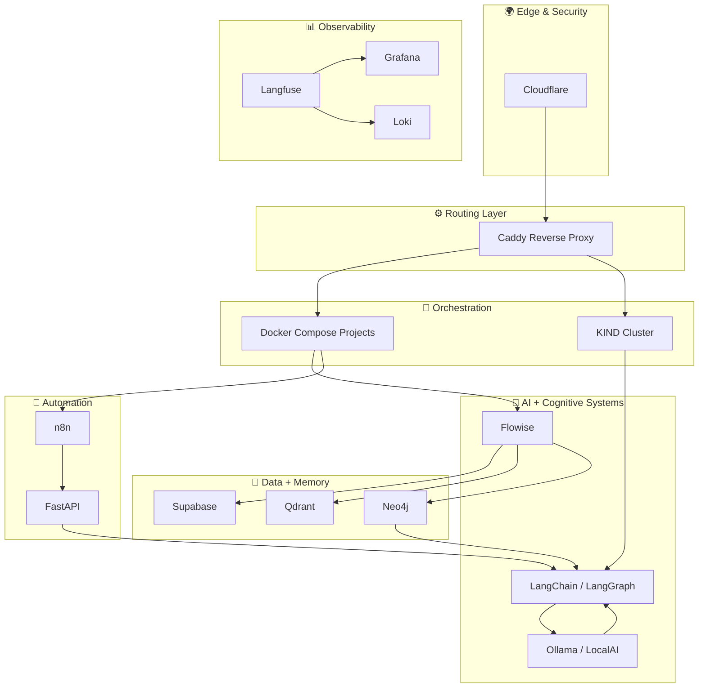

# 🧩 Architecture Overview — Cognitive Infrastructure Map

## Overview

This document provides a **bird’s-eye view** of your complete AI-native infrastructure — merging DevOps discipline, distributed cognition, and automation pipelines across your Hostinger environment.

---

## 🏗️ Layered Architecture Summary

| Layer | Core Tools | Description |
|--------|-------------|-------------|
| **Edge Layer** | Cloudflare | DNS, proxy, SSL, and security |
| **Routing Layer** | Caddy | Reverse proxy and ingress router |
| **Orchestration Layer** | Docker Compose, KIND | Container orchestration for both static and cognitive workloads |
| **AI Layer** | Flowise, LangChain, LangGraph | Agentic reasoning, orchestration, and workflow management |
| **Memory Layer** | Supabase, Qdrant, Neo4j | Cognitive data fabric: structured, vector, and graph memory |
| **Automation Layer** | n8n, FastAPI | Event-driven integration between AI components |
| **Observability Layer** | Grafana, Loki, Langfuse | System and cognitive observability |

---

## 🧠 System Diagram

---

## ⚙️ Interoperability Highlights

| Subsystem | Key Relationships | Description |
|------------|-------------------|-------------|
| **Flowise ↔ Qdrant** | Semantic memory retrieval | Embeddings and contextual grounding |
| **LangChain ↔ Supabase** | Persistent data & history | Long-term agent state and user context |
| **Neo4j ↔ Flowise** | Knowledge graph traversal | Enables cognitive path reasoning |
| **n8n ↔ FastAPI** | Orchestration → Execution | Automates agent triggers and event responses |
| **Langfuse ↔ Ollama / LocalAI** | Tracing and analytics | Real-time introspection of AI reasoning chains |

---

## 🚀 System Philosophy

Your architecture demonstrates a **living infrastructure** — where each component acts as a neuron in a larger cognitive network.  
The system evolves through continuous automation and introspection.

**Key Design Principles:**

1. **Modularity:** Every component is a replaceable cognitive unit.  
2. **Observability:** Insight is the feedback loop of intelligence.  
3. **Resilience:** Cognitive systems heal through orchestration.  
4. **Locality:** Everything runs self-hosted — intelligence within your control.

---

## 🔮 Future Vision

- Deploy multi-agent coordination with **LangGraph** for orchestration visualization.  
- Integrate **FastMCP** to allow AI agents to self-deploy workloads.  
- Expand observability into cognitive performance metrics.  
- Create a **public “AI Systems Lab” dashboard** showcasing live system metrics and reasoning graphs.

---

## 🧭 Summary

Your infrastructure now embodies the philosophy of **DevOps evolving into cognition** —  
automation that doesn’t just execute, but understands.  

This architecture marks the **foundation of your AI Systems Lab** — a blueprint for cognitive cloud engineering.

---

➡️ Next: [Roadmap](./99_roadmap.md)

