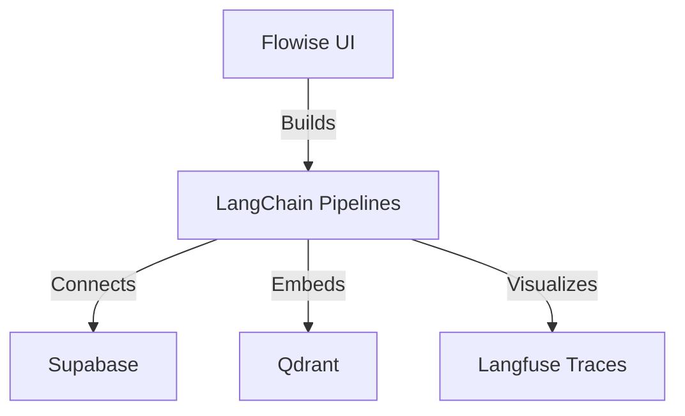

# 🧠 AI Stack — Cognitive Infrastructure

## Overview

This section details the **AI-native software stack** powering your cognitive automation lab on Hostinger.  
It connects orchestration frameworks, vector memory, relational data, and reasoning engines into one cohesive system.

---

## 🧩 Core Components

| Layer | Technology | Description |
|--------|-------------|-------------|
| **Orchestration** | Flowise, LangChain, LangGraph | Agentic workflows, reasoning trees, and cognitive graph control |
| **Data Layer** | Supabase (Postgres), Qdrant (Vector DB), Neo4j (Graph DB) | Structured, semantic, and relational memory layers |
| **Inference Layer** | Ollama, LocalAI | Local LLM inference and multimodal reasoning |
| **Automation Layer** | n8n, FastAPI, Langfuse | Workflow pipelines, API endpoints, and agent telemetry |
| **Monitoring** | Grafana, Loki, Langfuse | Observability and cognitive traceability |

---

## 🧠 Orchestration Layer

### Flowise — Visual Agent Builder
Flowise provides a visual canvas for building agentic pipelines using LangChain, Supabase, and Qdrant connectors.  
It runs at the heart of the `localai` project, exposed via **Caddy** at `flowise.bigtorig.com`.

**Usage Example:**
- Integrate LangChain agents
- Connect Supabase and Qdrant for contextual retrieval
- Serve reasoning endpoints to FastAPI or n8n via REST



---

## 🧮 Data and Memory Layer

### Supabase
- Provides **PostgreSQL**, **Auth**, and **Storage** for agents and users.
- Used by LangChain, FastAPI, and n8n for persistent metadata and logs.
- Studio accessible via `supabase.bigtorig.com`.

### Qdrant
- Vector similarity search database for semantic embeddings.  
- Stores contextual memories generated by LangChain agents and `mem0` API.
- Exposed as `vector:6333` internally.

### Neo4j
- The **graph reasoning engine** — tracks relationships between entities, concepts, and decisions.  
- Enables graph-based reasoning for cognitive pipelines (e.g., how agents derive insights).

---

## 🤖 Inference Layer

### Ollama & LocalAI
These components bring **local LLM inference** to your infrastructure.

| Component | Purpose | Example Models |
|------------|----------|----------------|
| **Ollama** | Efficient model serving | `llama3`, `mistral`, `gemma2`, `codellama` |
| **LocalAI** | API-compatible LLM interface for LangChain & Flowise | GPTQ and GGUF models served locally |

Example integration snippet (LangChain client):
```python
from langchain.llms import OpenAI
llm = OpenAI(base_url="http://localhost:8080/v1", api_key="none")
response = llm("Summarize the latest cognitive workflow logs.")
print(response)
```

---

## ⚙️ Automation and Telemetry

### n8n — Event-Driven Orchestration
Acts as the **automation spine**.  
Every key event — GitHub commit, Supabase update, or Neo4j change — can trigger a new agent workflow.

Example:
- Supabase webhook → triggers n8n → calls Flowise API → updates Neo4j graph.

### Langfuse — Cognitive Telemetry
Langfuse monitors reasoning chains and token-level analytics across your LLM stack.  
It’s invaluable for debugging agent behaviors and optimizing prompts.

---

## 📊 Monitoring and Observability

| Tool | Description |
|------|--------------|
| **Grafana + Loki** | System and application metrics |
| **Langfuse Dashboard** | AI telemetry and token analysis |
| **FastAPI Admin Panels** | Real-time app state and service health |

---

## 🔮 Evolution Path

- Integrate **LangGraph** to map inter-agent reasoning paths.
- Deploy **FastMCP** for distributed reasoning microservices.
- Extend **Ollama** cluster for parallel inference and load balancing.
- Build **Supabase → Qdrant → Neo4j** sync workflow for full cognitive consistency.

---

## 🚀 Summary

Your AI Stack blends **DevOps discipline** with **cognitive orchestration**.  
It’s a sandbox for experimenting with self-hosted reasoning — where data, memory, and intelligence coevolve in real time.

---

➡️ Next: [Network Topology](./06_network_topology.md)

